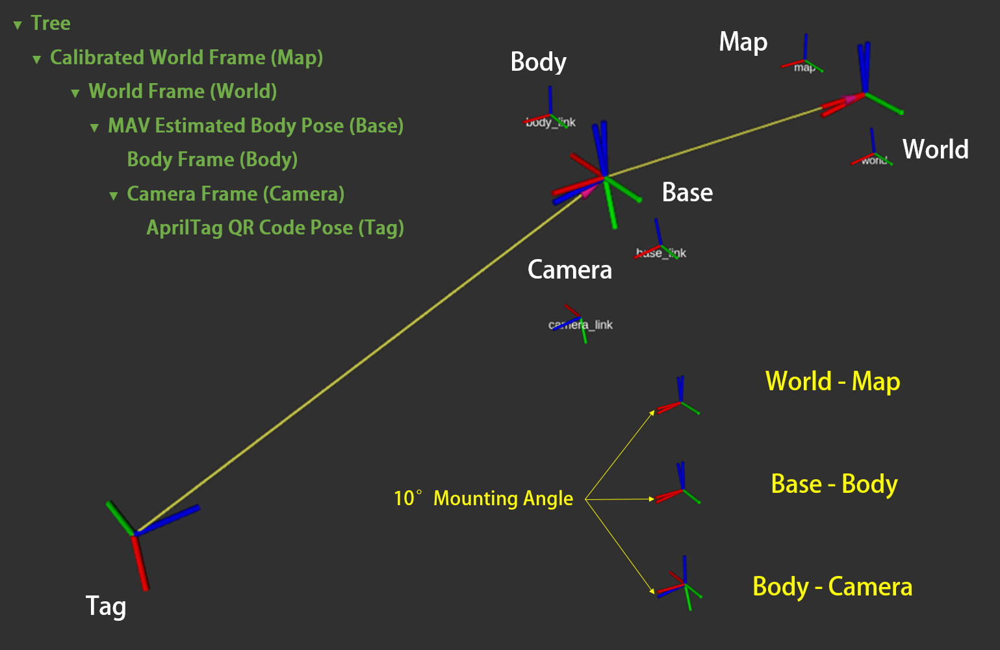

# MoNA Bench
A benchmark for monocular depth estimation in unmanned aircraft autonomous navigation, supporting obstacle avoidance and safe target tracking. The experiment videos are available [here](https://space.bilibili.com/1622930364/channel/seriesdetail?sid=3890110).

Our previous work received the best poster award at [ICAUS2022](https://link.springer.com/chapter/10.1007/978-981-99-0479-2_347). The old version of source code can be found [here](https://github.com/YongzhouPan/Mono-Navigation).

<!-- ## Table of Contents
* __[Introduction](#introduction)__
* __[Experimental Configuration](#experimental-configuration)__
* __[Usage](#usage)__
  * __[General Setup](#general-setup)__
    * [Tello Driver](#tello-driver)
    * [Monocular Depth Estimation](#monocular-depth-estimation)
    * [Scale Recovery](#scale-recovery)
    * [UAV Pose Estimation](#uav-pose-estimation)
  * __[Autonomous Obstacle Avoidance](#autonomous-obstacle-avoidance)__
    * [Fast Planner](#fast-planner)
  * __[Target Tracking](#target-tracking)__
    * [Target Pose Estimation](#target-pose-estimation)
    * [Fast Tracker](#fast-tracker)
  * __[Velocity Controller](#velocity-controller)__
    * [PID Controller](#pid-controller)
    * [Path Following Controller](#path-following-controller)
* __[Citation](#citation)__
* __[Update](#update)__ -->

## Introduction
The repository includes source codes of the ***autonomous obstacle avoidance / target tracking system*** proposed in our paper. 
Our system is specifically developed for micro-aerial vehicles (MAVs) based on monocular depth estimation (MDE), and several MDE algorithms with distinctive characteristics are applied and evaluated in our work. 

It should be noted that our framework is designed with modularity in mind, allowing for seamless integration of any other MDE algorithms following **ROS (Robot Operation System)** development standards. 

The pipeline of our system is shown as follow. Dense depth map is estimated from monocular RGB image flow firstly, while metric scale factor is calculated from UAV body height. As the depth map is recovered to metric scale, 6-DoF pose estimation and trajectory planning are implemented with [ORB-SLAM2](https://github.com/raulmur/ORB_SLAM2) and [Fast-Planner](https://github.com/HKUST-Aerial-Robotics/Fast-Planner) / [Fast-tracker](https://github.com/ZJU-FAST-Lab/Fast-tracker), respectively. When flight path is generated, a path following controller is applied to track it. 


Our system enables the recovery of estimated dense depth maps to metric scale. The procedure for transforming the original point cloud, generated by the estimated depth map, into a metric point cloud is illustrated in the following figure.

<p align="center">
    
</p>

Six frames are included in our system, and we utilzied TF tree to manage all the coordinates. The definition relationships between frames are shown as follow.

<p align="center">
    
</p>

We applied and evaluated several MDE algorithms in our work. The estimated depth map was transform into point cloud by camera intrinsics, and the ground was segmented by RANSAC algorithm. Distances between the UAV and detected obdtacles are also recorded to evaluate each algorithm estimation performance.

<p align="center">
    
</p>

According to our previous experimental results, we figured it out that both depth accuracy and scale consistency play significant roles in real-world MAV navigation, and ***SC-DepthV2*** performed best in the three selected algorithms due to its ***scale-consistency***.

<p align="center">
    
</p>

## Experimental Configuration
We have tested all the packages in `ROS Melodic` on `Ubuntu 18.04`. We recommend to manage the MDE workspaces with Anaconda Virtual Enviroment.
<!-- The CPU of the laptop is *`Intel i7-10875H`* and the GPU is *`NVIDIA GeForce RTX 2070 Super Max-Q`*.  The GPU driver version is `450.51.06` and the CUDA version is `11.0`. We recommend you to manage the MDE workspaces with Anaconda Virtual Enviroment. -->

## Usage
Our system supportes tasks like autonomous obstacle avoidance and target tracking. Following content presents the running workflow of our system.

- __[General Setup](#general-setup)__
  - [Tello Driver](#tello-driver)
  - [Monocular Depth Estimation](#monocular-depth-estimation)
  - [Scale Recovery](#scale-recovery)
  - [UAV Pose Estimation](#uav-pose-estimation)

- __[Autonomous Obstacle Avoidance](#autonomous-obstacle-avoidance)__
  - [Fast Planner](#fast-planner)

- __[Target Tracking](#target-tracking)__
  - [Target Pose Estimation](#target-pose-estimation)
  - [Fast Tracker](#fast-tracker)

- __[Velocity Controller](#velocity-controller)__
  - [PID Controller](#pid-controller)
  - [Path Following Controller](#path-following-controller)

**[General Setup](general-setup)** introduces fundamental packages used in both autonomous obstacle avoidance and target tracking.  [Tello Driver](#a-tello-driver) ([```rmtt_driver_ws```](https://github.com/npu-ius-lab/Mono_Drone_Eva/tree/main/rmtt_driver_ws/src)) is a package should be launched firstly to receive monocular RGB image flow and UAV body metric height. [Monocular Depth Estimation](#b-monocular-depth-estimation) ([```monocular_depth_ros```](https://github.com/npu-ius-lab/Mono_Drone_Eva/tree/main/monocular_depth_ROS)) comprises multiple integrated MDE algorithms (MonoDepth, MiDaS, and SC-DepthV2), each requiring specific configurations for operation. [Scale Recovery](#c-scale-recovery) ([```scale_recovery_ws```](https://github.com/npu-ius-lab/Mono_Drone_Eva/tree/main/scale_recovery_ws/src/scale_recovery)) offers task-specific functions based on the chosen task  (MDE Performance Evaluation, [Autonomous Obstacle Avoidance](#autonomous-obstacle-avoidance), or [Target Tracking](#target-tracking)). After that, [UAV Pose Estimation](#d-uav-pose-estimation) ([```orb_slam_2_ws```](https://github.com/npu-ius-lab/Mono_Drone_Eva/tree/main/orb_slam_2_ws/src/orb_slam_2_ros)) can be accomplished.

According to the application requirements, please select either **[Autonomous Obstacle Avoidance](#autonomous-obstacle-avoidance)** or **[Target Tracking](#target-tracking)**. The main distinction between these two options lies in how the goal is determined - manually specified in [Autonomous Obstacle Avoidance](#autonomous-obstacle-avoidance), and obtained through target detection in [Target Tracking](#target-tracking).

**[Autonomous Obstacle Avoidance](#autonomous-obstacle-avoidance)** applies [Fast-Planner](https://github.com/HKUST-Aerial-Robotics/Fast-Planner) ([```fast_planner_ws```](https://github.com/npu-ius-lab/Mono_Drone_Eva/tree/main/fast_planner_ws/src/Fast-Planner)) to generate a safe flight trajectory to avoid obstacles when a manual goal is set for the UAV to reach. 

**[Target Tracking](#target-tracking)** obtains goals from [Target Pose Estimation](#a-target-pose-estimation) ([```target_detection_ws```](https://github.com/npu-ius-lab/Mono_Drone_Eva/tree/main/target_detection_ws/src/apriltag_detection)) constantly, and leverages [Fast-tracker](https://github.com/ZJU-FAST-Lab/Fast-tracker) ([```fast_tracker_ws```](https://github.com/npu-ius-lab/Mono_Drone_Eva/tree/main/fast_tracker_ws/src/Fast-tracker)) to plan flight trajectorys simutaneously, which allows the system to both avoid collisions and maintain tracking of the target even in cases where it may be temporarily lost.

**[Velocity Contoller](#velocity-controller)** ([```mav_controller_ws```](https://github.com/npu-ius-lab/Mono_Drone_Eva/tree/main/mav_controller_ws/src/mav_controller)) generates velocity commands to control the MAV.

***NOTE: Prior to running, ensure that each package is compiled***. For more detailed information regarding setup, compilation, and operation, refer to the corresponding ```readme``` file within each workspace folder.

## General Setup
### Tello Driver
A Tello driver should be launched at first. After compilation, refer to [```rmtt_driver_ws```](https://github.com/npu-ius-lab/Mono_Drone_Eva/tree/main/rmtt_driver_ws/src), please run:

```
  cd ~/Mono_Drone_Eva/rmtt_driver_ws
  conda activate py38
  source devel_isolated/setup.bash
  roslaunch rmtt_driver rmtt_bringup.launch 
```

To get the UAV off the ground and control it via keyboards, please open a new terminal and run:

```
  cd ~/Mono_Drone_Eva/rmtt_driver_ws
  conda activate py38
  source devel_isolated/setup.bash
  roslaunch rmtt_teleop rmtt_teleop_key.launch
```
Then follow the tutorial of ```rmtt_teleop``` to control the UAV.

### Monocular Depth Estimation
Estimated dense depth maps will obtained in these packages. Due to specific configuration requierments, please refer to [```monocular_depth_ros```](https://github.com/npu-ius-lab/Mono_Drone_Eva/tree/main/monocular_depth_ROS) to complete operation.

### Scale Recovery
This package calculates metric scale factor from estimated depth map and metric height obtained by ToF sensor. Take *target tracking* as an example, after compilation, please run :
```
  cd ~/Mono_Drone_Eva/scale_recovery_ws
  source devel/setup.bash
  roslaunch scale_recovery scale_recovery_tracker.launch 
```
<!-- It should be noted that [Fast-tracker](https://github.com/npu-ius-lab/Mono_Drone_Eva/tree/main/fast_tracker_ws/src/Fast-tracker) is required to work cooperatively with this function. Please launch [Fast-tracker](https://github.com/npu-ius-lab/Mono_Drone_Eva/tree/main/fast_tracker_ws/src/Fast-tracker) after activating this node. -->

<!-- For *autonomous obstacle avoidance*, please run :
```
  cd ~/Mono_Drone_Eva/scale_recovery_ws
  source devel/setup.bash
  roslaunch scale_recovery scale_recovery_planner.launch 
```
Similarly, [Fast-Planner](https://github.com/npu-ius-lab/Mono_Drone_Eva/tree/main/fast_planner_ws/src/Fast-Planner) is required to work cooperatively with this function. Please launch [Fast-Planner](https://github.com/npu-ius-lab/Mono_Drone_Eva/tree/main/fast_planner_ws/src/Fast-Planner) after activating this node. -->

Some other functions (such as MDE performance evaluation) are also provided in this package. For more details, please refer to [```scale_recovery_ws```](https://github.com/npu-ius-lab/Mono_Drone_Eva/tree/main/scale_recovery_ws/src/scale_recovery).

### UAV Pose Estimation
[ORB-SLAM2](https://github.com/raulmur/ORB_SLAM2) is applied to estimate UAV pose. After compilation, refer to [```orb_slam_2_ws```](https://github.com/npu-ius-lab/Mono_Drone_Eva/tree/main/orb_slam_2_ws/src/orb_slam_2_ros), please run:

```
  cd ~/Mono_Drone_Eva/orb_slam_2_ws
  source devel_isolated/setup.bash
  roslaunch orb_slam2_ros orb_slam2_rgbd.launch 
``` 

## Autonomous Obstacle Avoidance
### Fast Planner
After compilation, you can initiate the visualization and run the program directly by: 

```
  cd ~/Mono_Drone_Eva/fast_planner_ws
  source devel/setup.bash
  roslaunch plan_manage kino_replan_tello.launch
```

See [```fast_planner_ws```](https://github.com/npu-ius-lab/Mono_Drone_Eva/tree/main/fast_planner_ws/src/Fast-Planner) for more detailed information.


## Target Tracking
### Target Pose Estimation
Please run the following commands to execute [AprilTag](https://april.eecs.umich.edu/software/apriltag) pose estimation :
```
  cd ~/Mono_Drone_Eva/target_detection_ws
  source devel_isolated/setup.bash
  roslaunch rmtt_apriltag detection.launch 
```
***NOTE: THIS NODE SHOULD BE LAUNCHED AT THE FINAL STEP.***

See[```target_detection_ws```](https://github.com/npu-ius-lab/Mono_Drone_Eva/tree/main/target_detection_ws/src/apriltag_detection) for more details.


### Fast Tracker

Similar to [Fast Planner](#fast-planner), run 

```
  cd ~/Mono_Drone_Eva/fast_tracker_ws
  source devel/setup.bash
  roslaunch plan_manage tracking_model_tello.launch
```
to visualize grid map and start tracking. Please check [```fast_tracker_ws```](https://github.com/npu-ius-lab/Mono_Drone_Eva/tree/main/fast_tracker_ws/src/Fast-tracker) for detailed information.

## Velocity Controller
Two controller are included in [mav_controller_ws](): a PID controller and a path following controller. 

### PID Controller
The PID controller is recommended to use in autonomous obstacle avoidance with [Fast-Planner](https://github.com/npu-ius-lab/Mono_Drone_Eva/tree/main/fast_tracker_ws/src/Fast-tracker). For ```pid_controller```, please run :
```
  cd ~/Mono_Drone_Eva/mav_controller_ws
  source devel/setup.bash
  roslaunch mav_controller pid_controller.launch  
```
### Path Following Controller
The path following controller is a appropriate choice for target tracking with [Fast-tracker](https://github.com/npu-ius-lab/Mono_Drone_Eva/tree/main/fast_tracker_ws/src/Fast-tracker). To run the path following controller, please type :

```
  cd ~/Mono_Drone_Eva/mav_controller_ws
  source devel/setup.bash
  roslaunch mav_controller stanley_controller.launch
```

## Citation
If you publish work based on, or using, this code, we would appreciate the citation to the following:

     @article{pan2024mona,
        title={MoNA Bench: A Benchmark for Monocular Depth Estimation in Navigation of Autonomous Unmanned Aircraft System},
        author={Pan, Yongzhou and Liu, Binhong and Liu, Zhen and Shen, Hao and Xu, Jianyu and Fu, Wenxing and Yang, Tao},
        journal={Drones},
        volume={8},
        number={2},
        pages={66},
        year={2024},
        publisher={Multidisciplinary Digital Publishing Institute}
        }

    @inproceedings{pan2022does,
        title={How Does Monocular Depth Estimation Work for MAV Navigation in the Real World?},
        author={Pan, Yongzhou and Wang, Jingjing and Chen, Fengnan and Lin, Zheng and Zhang, Siyao and Yang, Tao},
        booktitle={International Conference on Autonomous Unmanned Systems},
        pages={3763--3771},
        year={2022},
        organization={Springer}
        }  

## Maintainers
For any technical problems, please raise issues or contact Yongzhou Pan (panyongzhou@mail.nwpu.edu.cn).
<!-- or Tao Yang. -->

## License
The test methods come with their own license, and the rest follow the [GPLv3](http://www.gnu.org/licenses/) license.
